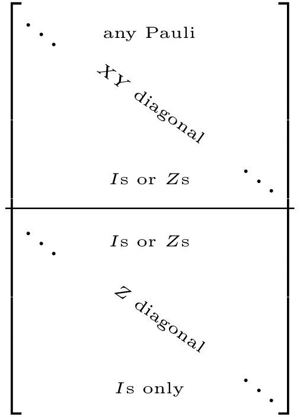
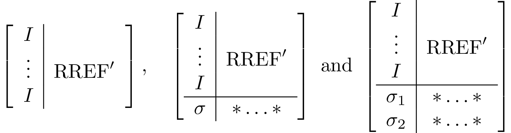

# Canonicalization operations

Three different types of canonicalization operations are implemented.

All of them are types of Gaussian elimination, with different choices for how to
relate the X and Z components.

## [`canonicalize!`](@ref)

First do elimination on all X components and only then perform elimination on
the Z components. Based on [garcia2012efficient](@cite).
It is used in [`logdot`](@ref) for inner products of stabilizer states.

The final tableaux, if square should look like the following


If the tableaux is shorter than a square, the diagonals might not reach all the way to the right.

```julia
julia> plot(canonicalize!(random_stabilizer(20,30)));
```


## [`canonicalize_rref!`](@ref)

Cycle between elimination on X and Z for each qubit. Particularly useful for
tracing out qubits. Based on [audenaert2005entanglement](@cite).
For convenience reasons, the canonicalization starts from the bottom row,
and you can specify as a second argument which columns to be canonicalized
(useful for tracing out arbitrary qubits, e.g., in [`traceout!`](@ref)).

The tableau canonicalization is done in recursive steps, each one of which results in something akin to one of these three options


```julia
julia> plot(canonicalize_rref!(random_stabilizer(20,30),1:30)[1]; xzcomponents=:together);
```


## [`canonicalize_gott!`](@ref)

First do elimination on all X components and only then perform elimination on
the Z components, but without touching the qubits that were eliminated during
the X pass.
Unlike other canonicalization operations, qubit columns are reordered,
providing for a straight diagonal in each block.
Particularly useful as certain blocks of the new created matrix are
related to logical operations of the corresponding code,
e.g. computing the logical X and Z operators of a [`MixedDestabilizer`](@ref).
Based on [gottesman1997stabilizer](@cite).

A canonicalized tableau would look like the following (the right-most block does
not exist for square tableaux).


```julia
julia> plot(canonicalize_gott!(random_stabilizer(30))[1]; xzcomponents=:together);
```


